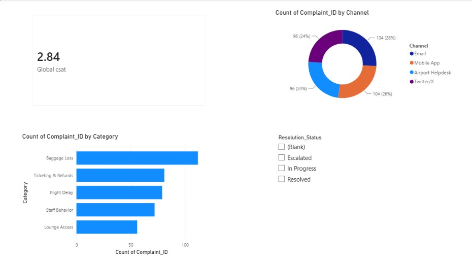

# ✈️ Passenger Complaints & Resolution Analytics (Customer Experience)

## 📌 Project Overview
This business intelligence portfolio project analyzes 500 operational passenger complaint records. The objective is to monitor service desk efficiency, track resolution turnaround times, and isolate root causes behind customer experience trends.

## 🛠️ Tech Stack & Skills
- **Data Intake & Structural Cleaning:** Microsoft Excel (Delimited alignment, Text-to-Columns)
- **Data Modeling & Analytics Engine:** Power BI Desktop
- **Interactive Visualization Elements:** Executive KPI cards, Clustered Bar Charts, Channel Distribution Donut Charts, and Dynamic Attribute Slicers

## 📈 Executive Control Tower Dashboard

## 💡 Top Strategic Insights Discovered
1. **The Social Media Friction Point:** Utilizing the interactive resolution slicer reveals that **100% of 'Escalated' passenger complaints originate exclusively through Twitter/X**, causing a severe impact on the global Customer Satisfaction (CSAT) score down to a flat **1.00/5.00**.
2. **Primary Operational Bottleneck:** **Baggage Loss** represents the highest frequency issue across all channels, identifying a critical backend terminal logistics constraint that needs infrastructural review.
3. **Actionable Business Recommendation:** Reallocate a segment of frontline airport operations staff to monitor active social media intake queues during peak arrival waves to resolve ticketing and processing escalations before friction spikes.
